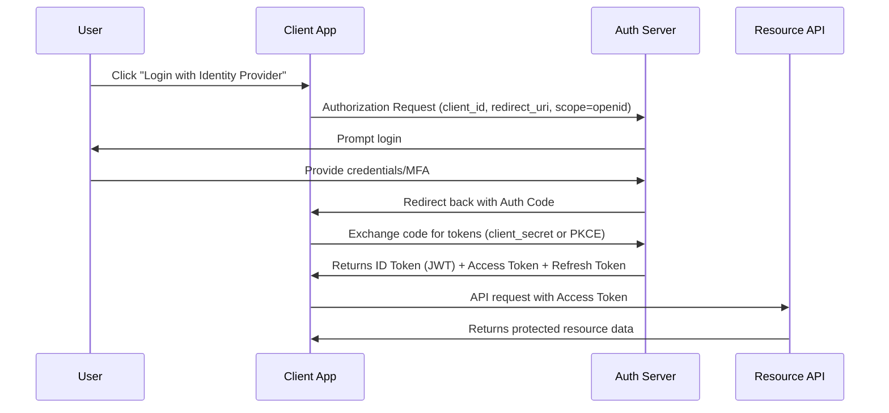
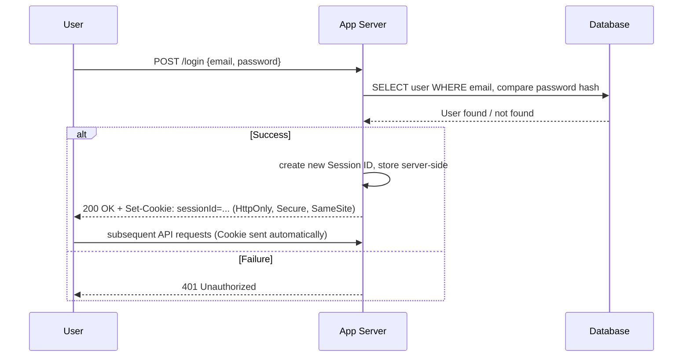
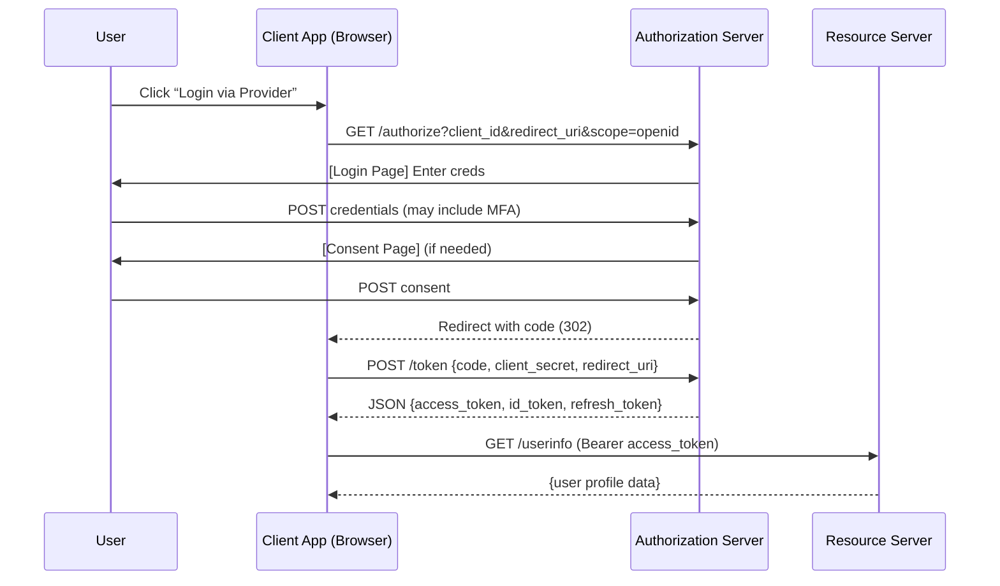
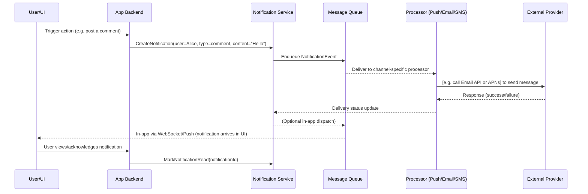

# Executive Summary  
Authentication and user notifications are fundamental components of modern applications.  **Authentication** verifies user identity and grants access to protected resources, while **user notifications** inform, engage, and alert users about events or updates.  Good authentication protects accounts (e.g. by strong passwords or multi-factor verification) and supports various flows (password-based, federated SSO, passwordless, etc.) with secure token management.  Effective notifications span in-app, push, email, SMS, and webhooks, respecting user preferences and legal requirements (e.g. GDPR/CCPA).  This report reviews definitions, common flows (with sequence diagrams), token handling and security (cookies vs storage, CSRF/XSS defenses), notification types/channels (with templates, priority, batching, retry logic, and user opt-in/out), as well as end-to-end interaction flows.  An implementation checklist (endpoints, payloads, response codes), example data models (User, Device, Notification, Subscription) and sample schema are provided.  Monitoring (logging, metrics, SLAs) and testing strategies are covered, along with security/privacy compliance (GDPR consent, data protection) and backward-compatibility.  Finally, recommended architectural patterns (e.g. async message queues vs direct delivery, microservices vs monolith, in-house vs third-party) are compared in tables, highlighting trade-offs.  Throughout, we cite standards and best-practice sources (OWASP, IETF RFCs, GDPR guidance, etc.) to guide design and implementation.

## 1. Definitions and Goals  

**Authentication (AuthN)** is the process of *verifying that a user (or entity) is who they claim to be*, typically by validating one or more credentials (passwords, tokens, biometrics, etc.)【27†L243-L252】.  Its goal is to prevent unauthorized access while providing a seamless user experience.  Best practices demand strong credential handling (hashed passwords, minimum lengths) and additional factors (MFA) for sensitive accounts【27†L303-L311】【38†L382-L390】. 

**User Notifications** are messages or alerts sent to users (via in-app UI, push, email, SMS, or webhooks) to inform them of events, updates, or actions requiring attention【44†L50-L53】【46†L1340-L1343】.  Goals include *keeping users informed and engaged* and *ensuring security awareness* (e.g. alerting on suspicious logins).  Notifications should be timely, relevant, and actionable (with clear content and context) while respecting user preferences and privacy laws.  They fall into broad categories (system alerts, social or action-based updates, account changes, marketing news) with different urgency and required channels【44†L150-L159】【44†L162-L166】.  

## 2. Common Authentication Flows  

### 2.1 Password-Based Login  
The classic flow is: the user submits a username/email and password to the server, which validates the credentials (typically by comparing a hashed password in its database) and then establishes a session.  The server often sets a secure session cookie or returns a token.  For example, upon successful login the server might respond with `Set-Cookie: sessionId=...; HttpOnly; Secure; SameSite=Strict` (making it inaccessible to JavaScript)【26†L553-L561】.  *Criteria:* use this when you need a simple, self-contained login (typical for many web apps).  Ensure strong password policies (e.g. per OWASP/NIST, require ≥8 characters if MFA is enabled, ≥15 if not【27†L303-L311】) and protect endpoints with HTTPS and rate limiting.  

### 2.2 Passwordless Authentication  
Passwordless methods eliminate traditional passwords.  **Email Magic-Link:** user submits email, system sends a one-time login link (or code) to their inbox; clicking it proves possession of that email.  **WebAuthn/FIDO2 (Passkeys):** the user uses a hardware or platform authenticator (e.g. device biometrics or a USB security key) to cryptographically sign a challenge.  OWASP notes that **passkeys** (FIDO2) combine “something you have” (device) and “something you know/are” (PIN or biometric) to create a strong, phishing-resistant factor【38†L458-L465】.  *When to use:* for improved UX and security (no password to steal), especially on mobile or where supporting modern browsers/hardware.  The trade-off is device enrollment complexity and fallback design for lost factors.  

### 2.3 OAuth 2.0 / OpenID Connect (OIDC)  
OAuth2 (RFC 6749) is a framework for delegated authorization; OpenID Connect builds an **identity layer on top of OAuth2**【33†L232-L240】【31†L78-L85】.  Common OAuth2 flows include: **Authorization Code Flow** (for web or native apps), **PKCE (Proof Key for Code Exchange)** variant (for public clients like SPAs/mobile), **Client Credentials Flow** (server-to-server), and the deprecated **Implicit Flow** (former SPA flow; now discouraged).  In OIDC, after successful auth the Authorization Server issues an *ID Token* (a signed JWT containing user identity claims) and an *Access Token* for APIs【33†L232-L240】.  *Diagrams:* 



*Criteria:* Use OAuth2/OIDC when you need **third-party login** (e.g. Google/Facebook) or **single sign-on (SSO)** across domains/apps. OIDC is recommended for modern identity due to its standardized ID Token for user info【33†L232-L240】. The **PKCE** extension is mandatory for SPAs for security. Beware that OAuth2/OIDC introduces additional complexity (authorization server setup, secure storage of client secrets or PKCE verifier, token lifecycles)【31†L78-L85】.

### 2.4 SAML 2.0 (Security Assertion Markup Language)  
SAML is an XML-based protocol for exchanging auth assertions, widely used in enterprise SSO.  In an **SP-initiated SSO**, the user tries to access a Service Provider (SP); the SP redirects the user’s browser to an Identity Provider (IdP) with a SAML AuthnRequest.  The IdP authenticates the user (e.g. via corporate login) and sends a signed SAML Assertion back to the SP (usually via the user’s browser form-post or redirect).  In an **IdP-initiated** flow, the user logs into the IdP first, then selects the SP, and the IdP pushes an Assertion to it.  *Criteria:* Use SAML when integrating with existing enterprise IdPs (Active Directory Federation Services, Okta, etc.) that support it.  SAML offers strong security and audit features, but is XML-heavy and can be more cumbersome than OAuth/OIDC.  As OASIS notes, “SAML defines a framework for exchanging security information between online business partners”【35†L293-L300】.

### 2.5 Multi-Factor Authentication (MFA)  
MFA requires two or more independent factors (e.g. password **+** one-time code or hardware token)【38†L382-L390】. Common flows: after primary credential validation, the system prompts for a second factor (e.g. SMS or authenticator app OTP, or an app push).  OWASP advises requiring MFA *at least* at initial login, and for high-risk actions (changing password/email, disabling MFA, admin ops)【38†L382-L390】. For One-Time Passwords (OTP), use short-lived (TTL) codes, single-use, strict attempt limits, and do **not** log or store them in plaintext【38†L402-L410】. If an MFA attempt fails repeatedly, treat it as suspicious: “Notify the user of the failed login attempt… include the time, browser and geographic location… optionally email them as well”【38†L478-L485】. Newer MFA options like FIDO2/WebAuthn (passkeys) provide phishing-resistant login: the user’s device signs a challenge with a private key after local PIN/biometric verification【38†L458-L465】.

### 2.6 Session vs. Token and Refresh Flows  
After authentication, the server issues a **session identifier or token**.  In **stateful sessions**, the server stores session state (in-memory or DB) and sends the client a session ID cookie.  The OWASP Session Management guide recommends cookies (with HttpOnly/Secure flags) as the preferred session token carrier【23†L37-L42】【26†L553-L561】. By contrast, **stateless tokens** (e.g. JWTs as access tokens) let the client present a signed token on each request.  JWTs are self-contained and work well for APIs and microservices, but must be short-lived and carefully managed (see Section 3).  OWASP notes that if an app *doesn’t need to be stateless*, traditional sessions (with hardened cookies) may be simpler and more secure【40†L279-L287】.

**Refresh Tokens:** In token-based systems (OAuth2/OIDC), a refresh token lets the client obtain new access tokens without re-prompting the user.  Refresh tokens must be stored securely (server-side or in an HttpOnly cookie) and should be rotated/invalidated on use to reduce risk【42†L379-L387】【42†L478-L485】.  Use **refresh token rotation** for SPAs (per OAuth2/OIDC best practice) to ensure a stolen refresh token cannot be replayed【42†L462-L466】.  If no refresh token is used (e.g. public SPA without PKCE/rotation), fallback mechanisms like silent re-auth (via hidden iframe) or cookies may be needed【42†L432-L441】【42†L449-L458】.

**Decision Criteria:** Flow choice depends on context.  E.g.:

| Flow/Method           | When to Use / Pros                                  | Drawbacks / Cons                                 |
|-----------------------|----------------------------------------------------|--------------------------------------------------|
| **Password Login**    | Simple web or mobile apps; full control over auth   | User-managed creds (phishing risk); must secure and store hashes【27†L303-L311】 |
| **Passwordless**      | Improve UX (no creds to type); FIDO2 prevents phishing【38†L458-L465】 | Requires device support/enrollment; recovery flow needed |
| **OAuth2/OIDC Code**  | SSO or social login; API access tokens; secure best practice【31†L78-L85】【33†L232-L240】 | Complex setup (auth server, tokens, clients) |
| **SAML 2.0**          | Enterprise SSO federations; mature standard【35†L293-L300】 | Heavy XML, steeper learning curve |
| **MFA (OTP/SMS)**     | Added security for critical accounts; protects against password theft【38†L382-L390】 | Added user friction; SMS costs and reliability issues |
| **FIDO2/WebAuthn**    | Phishing-resistant strong MFA; passwordless option【38†L458-L465】 | Requires user device/passkey; not universal yet |
| **Session Cookies**   | Traditional web apps; server stores state (easier revocation)【26†L553-L561】 | Doesn’t scale well to APIs or cross-domain apps |
| **JWT Access Tokens** | API/microservices or mobile apps; stateless; portable【40†L225-L234】 | Harder to revoke; must manage expiration and storage securely【40†L331-L340】 |

## 3. Token and Session Management  

**Secure Storage:** Use cookies with security attributes for tokens whenever possible. OWASP urges setting `HttpOnly` (prevents JS access, mitigating XSS theft) and `Secure` flags (send only over HTTPS)【26†L553-L561】【26†L633-L641】.  The `SameSite` cookie attribute (Strict or Lax) helps prevent CSRF by not sending cookies on cross-site requests【26†L568-L574】. Avoid storing sensitive tokens in `localStorage` or `sessionStorage`, as they persist in browser storage and are accessible to JavaScript. OWASP warns that *“the standards do not require localStorage data to be encrypted-at-rest”*, so data in localStorage can be read from disk if compromised【26†L670-L676】. In summary, prefer HttpOnly cookies (or secure platform credential storage on mobile) for session/auth tokens, and set short expiration. For browser tokens, one pattern is to store the refresh token in an HttpOnly cookie and send access tokens in a JavaScript header; this keeps long-lived secrets out of script context.

**Rotation & Expiration:** Tokens should have limited lifetime. Access tokens (JWTs) should expire in minutes or hours to limit exposure if stolen【42†L379-L387】. Refresh tokens (if used) should be long enough for usability but implement **rotation**: every time a refresh is used, issue a new one and invalidate the old. This way, a leaked refresh token is short-lived. OAuth2 standards encourage rotating refresh tokens for public clients (e.g. SPAs)【42†L462-L466】. Always define a clear expiration (in the JWT `exp` claim or cookie `Max-Age`), and handle it gracefully (e.g. catch 401 and attempt token refresh or re-login). The OWASP JWT cheat sheet emphasizes avoiding very long-lived access tokens and suggests a short lifespan (minutes to a few hours)【42†L362-L370】.

**Revocation:** Stateless tokens (like JWT) have no built-in revocation. To force-logout a JWT or revoke a refresh token, maintain a revocation list or timestamp. OWASP recommends storing revoked token identifiers in a database: on logout or compromise, add the token or user to a blocklist that all API checks【41†L39-L45】. For example, include a “last-logout” timestamp in the user’s record; any JWT issued before that time is considered invalid. Ensure the revocation data is shared across servers (e.g. a shared DB or cache) so revoked tokens are honored cluster-wide【41†L39-L45】.

**CSRF Mitigation:** When using cookies for auth, protect against CSRF. Use `SameSite` cookies (at least Lax) as described【26†L568-L574】. Additionally, implement anti-CSRF tokens on state-changing requests. Since the AuthN system itself usually uses cookies, the same CSRF defenses apply to logout, password changes, etc. For REST APIs using bearer tokens (Authorization header) instead of cookies, CSRF is less of a concern.  

**XSS Mitigation:** Since XSS can steal tokens from in-page storage or cookies, implement strict content security policies (CSP) and input sanitization across the app. Marking auth cookies as `HttpOnly` prevents JS from reading them【26†L553-L561】. Do not put tokens in URLs (query strings), as they may leak in referrers or logs. Use `Content-Security-Policy` headers to restrict allowed scripts. Keep all libraries updated to avoid known XSS vulnerabilities.  

**Threat Model & Mitigations:** Consider attackers who may steal tokens (e.g. via XSS, network sniffing, or device compromise). Ensure TLS (HTTPS) everywhere (OAuth2 RFC6749 requires TLS【31†L78-L85】). Protect refresh tokens (only send over secure channels). Bind tokens to user context if possible: OWASP suggests adding a “user context” random secret stored in a secure, HttpOnly cookie that must match claims in the JWT to prevent reuse【40†L338-L344】. In high-risk apps, store session state server-side (session IDs) so you can immediately invalidate sessions on breach. Always regenerate session IDs after login or privilege changes (to prevent fixation). If a token is suspected compromised, provide an easy logout endpoint that revokes tokens.

## 4. Notification Taxonomy and Delivery  

**Channels & Types:** Notifications can be sent via:  
- **In-App/UI:** Shown in the app’s notification center or feed. Good for high-fidelity content (images, rich UI) and when the user is actively using the app; no delivery cost.  
- **Mobile Push (APNs/FCM):** Native mobile notifications. They’re instant and attention-grabbing (e.g. badge, sound), but require explicit user opt-in via OS permissions and have payload limits. Use for urgent alerts when the user is off-app.  
- **Web Push:** Browser push (via Push API). Similar to mobile push, requiring opt-in consent from the user.  
- **Email:** Ubiquitous and reliable delivery (with SMTP or email service). Suitable for longer content, receipts, newsletters. Usually asynchronous (seconds latency). Requires opt-in for marketing; no strict opt-in needed for transactional/security alerts in many jurisdictions, but always offer unsubscribe links for marketing content【17†L131-L139】.  
- **SMS:** Very high reach (cell coverage) and immediacy (SMS arrives <10s), but limited length and high cost. Requires explicit opt-in (TCPA in the US, GDPR ePrivacy Directive) and is best reserved for critical alerts or two-factor codes.  
- **Webhooks/Server-to-Server:** Event notifications sent to a configured URL on another system. Not user-facing; used when your app notifies another service (e.g. CI/CD, payment gateways). Security concerns include verifying signatures (e.g. HMAC) on incoming webhooks.  

**Priority/Urgency:** Tag notifications by urgency (e.g. *urgent*, *normal*, *low*). Urgent messages (security alerts, system outages) bypass quiet hours or batching and may use multiple channels (push + email). Normal priority can respect “Do Not Disturb” and be batched. Many systems allow setting priority flags (e.g. FCM priority). Design the queue to handle priority: e.g. separate high-priority queue or processor【45†L27-L35】.  

**Batching/Digests:** To avoid overwhelming users, similar low-priority notifications can be batched or sent as daily/weekly digests. For example, social app comments may be aggregated. Scheduled sends and digests reduce load and improve UX. Non-functional requirements might include “Batch sends (digest emails)” and scheduling (silent hours)【46†L1340-L1343】. If batching, include context in each summary and allow users to expand details in-app.  

**Deduplication:** Ensure the same event isn’t sent twice. Assign a unique ID or idempotency key to each notification request; store recent keys in a cache (Redis) and ignore duplicates【59†L1461-L1470】. Also use database constraints or queue dedup mechanisms to prevent double delivery【59†L1461-L1470】.  

**Retry and Backoff:** External providers (email SMTP, APNs, Twilio) can fail. Implement exponential backoff and retry policies on failures. For example, retry at 1min, 5min, then 30min, then give up (move message to a Dead Letter Queue)【59†L1504-L1512】. Include a circuit breaker around each provider (e.g. stop sending via APNs after 5 consecutive failures for 1 minute)【59†L1504-L1512】. After all retries, alert ops or record the failure for later cleanup.  

**Rate Limiting:** Protect against notification spam and provider limits. For marketing emails/SMS, enforce user-based and global sending limits (e.g. max X SMS/user/day). Use the API gateway to throttle request rates. Respect provider rate limits (e.g. AWS SES/SendGrid quotas, FCM best practices) by pacing high-volume sends. As a guideline, only send SMS for critical/urgent items and fall back to cheaper channels for others【59†L1618-L1623】.  

**User Preferences & Consent:** Provide a notification settings UI where users opt in/out per channel and category. For example, allow toggling email vs. push vs. SMS for “security alerts”, “marketing updates”, etc. Prompt explicitly for push permissions when needed. Always honor “unsubscribe” requests in emails (as required by CAN-SPAM and ePrivacy)【17†L131-L139】. Per GDPR, **marketing communications require explicit consent**, whereas essential service or security notifications (like login alerts) may be sent under legitimate-interest or contract fulfillment【17†L131-L139】【7†L139-L147】. Still, clearly explain in your privacy policy what notifications are sent and allow opting out of non-essential ones. Record consent and enable users to withdraw it at any time【15†L49-L54】.  

**Templates:** Use templating to insert dynamic content (e.g. user name, event details) into emails or messages. Templates should support localization/translation. For security notifications (e.g. login alert), include pertinent details: time, location/IP, device type, and clear instructions (e.g. “If this wasn’t you, reset your password”)【59†L1497-L1504】【38†L478-L485】. Ensure no sensitive data (like full password or unencrypted tokens) is sent.  

**“Login Tracking” Emails:** As a security feature, many systems email the user after each login or on suspicious logins (new device/IP). This is considered a transactional security alert. OWASP advises notifying users of failed or unusual login attempts (including time, browser, geo) and optionally via email【38†L478-L485】. This helps users detect account compromise. Such emails are typically allowed even if the user has “unsubscribe”ed from marketing, but still respect GDPR: explain in settings and allow truly opting out of all notifications if requested.  

## 5. Interaction Diagrams (Mermaid)  
Below are sequence diagrams illustrating typical end-to-end flows.  

**User Login (Password Flow):**  


**OAuth2 Authorization Code (OIDC) Flow:**  


**Notification Delivery & Acknowledgement:**  

*(Diagrams show sample interactions; implementation may vary.)*  

## 6. Implementation Checklist and API Design  

**Key Steps:** Build and secure auth and notification components:  
- **User & Auth Setup:** Define user model (id, email, hashed_password, 2FA settings, timezone, etc.). Implement registration with email verification. Enforce strong password hashing (bcrypt/Argon2)【27†L303-L311】.  
- **Auth Endpoints:** Create endpoints such as `POST /login`, `POST /register`, `POST /logout`, `POST /refresh`, etc. Protect all with HTTPS. Store session state or issue tokens as per chosen flow. Implement MFA setup and enforcement flows (e.g. `POST /mfa/verify`).  
- **Token/Cookie Config:** Configure cookies with `Secure; HttpOnly; SameSite=Strict`【26†L553-L561】. Implement refresh token rotation and revoke logic. Handle token expiry (return 401 and require login or token refresh).  
- **Notification Engine:** Define event sources in the app to call the notification service (e.g. `NotifyService.send(userId, eventType, payload)`). Architect with a message queue (Kafka/RabbitMQ) to decouple sending【59†L1449-L1452】. Implement processors/workers for each channel that read from the queue and deliver messages (email via SMTP or API, SMS via provider, push via APNs/FCM).  
- **User Preferences:** Store user notification settings (opt-in flags by type/channel). When sending, check these preferences and legal opt-outs. For example, do not send marketing emails to users who opted out.  
- **Templates:** Create HTML/text templates for each notification type. Include placeholders for dynamic data (user name, event info). Use a library (e.g. Handlebars) to render messages in each language.  
- **Logging & Monitoring:** Log all auth events (login success/fail, logout, password resets) and notification events (queued, sent, failed). Use a structured logger. Instrument metrics: e.g. login attempts/sec, notification send rate, error counts. Set up alerts (e.g. high login-failure rate, queue depth spike).  
- **Testing:** Write unit and integration tests for each flow. Simulate login, MFA, token refresh, and notification send/receive. Include negative tests (invalid credentials, expired tokens). Perform security testing (inject XSS payloads, CSRF attacks) and load tests to verify rate limits and throughput.  

**API Endpoints Example:**  

| Endpoint              | Method | Payload / Params                                                    | Description                         | Responses              |
|-----------------------|--------|---------------------------------------------------------------------|-------------------------------------|------------------------|
| `POST /api/register`  | POST   | `{ email, password }`                                               | Create new user (send verification) | `201 Created` or errors|
| `POST /api/login`     | POST   | `{ email, password }`                                               | User login; returns session cookie  | `200 OK` or `401`      |
| `POST /api/mfa/verify`| POST   | `{ userId, code }`                                                   | Verify MFA code                     | `200 OK` or `401`      |
| `POST /api/refresh`   | POST   | `{ refresh_token }` or via HttpOnly cookie                           | Refresh tokens                     | `200` with new tokens  |
| `POST /api/logout`    | POST   | (Auth required, no body)                                            | Invalidate session/refresh token    | `204 No Content`       |
| `GET /api/notifications`| GET  | (Auth) query params: `?unread=true`                                  | List user’s notifications (paged)   | `200` JSON array       |
| `POST /api/notifications/subscribe` | POST | `{ type: "comment", channel: "email" }` (Auth)   | Subscribe user to a notification type | `200 OK`            |
| `POST /api/notifications/unsubscribe` | POST | `{ type: "marketing", channel: "sms" }` (Auth) | Unsubscribe from notifications     | `200 OK`               |
| `PUT /api/notifications/:id/read` | PUT | (Auth) | Mark notification as read | `200 OK` |
| `POST /api/admin/notify` | POST | `{ userId, type, message }` (Auth, admin) | Trigger a notification for a user (e.g. admin message) | `202 Accepted` |

*(Above are illustrative; actual routes may differ.)*  

**Data Model Example:** Sample tables/fields (SQL or NoSQL schema):  

| Table                | Fields                                                              |
|----------------------|---------------------------------------------------------------------|
| **User**             | `id (PK)`, `email` (unique), `password_hash`, `is_email_verified`, `mfa_enabled`, `mfa_secret`, `timezone`, `created_at`, `updated_at`  |
| **Device**           | `id (PK)`, `user_id (FK)`, `type` (e.g. "mobile","web-push"), `push_token`, `last_active_at`  |
| **Notification**     | `id (PK)`, `title`, `message`, `url`, `type` (e.g. "alert","message"), `created_at` |
| **UserNotification** | `user_id (FK)`, `notification_id (FK)`, `sent_at`, `delivered_at`, `read_at` (or flags like `is_read`), `channel`  |
| **Subscription**     | `user_id (FK)`, `category` (e.g. "marketing","security"), `channel` (email/SMS/etc), `opt_in` (bool) |

In practice, you may combine some tables (e.g. preferences into a JSON column on User) or split further. The `UserNotification` join table (or “inbox” table) maps each delivered notification to the user, allowing tracking of which were read/dismissed【51†L164-L172】.  

**Example Code Snippets:** *Node.js/Express:*  
```js
// Login handler in Express
app.post('/api/login', async (req, res) => {
  const { email, password } = req.body;
  const user = await db.findUserByEmail(email);
  if (!user || !bcrypt.compareSync(password, user.password_hash)) {
    return res.status(401).json({ error: 'Invalid credentials' });
  }
  // (Optional: check MFA before issuing tokens)
  const payload = { sub: user.id };
  const accessToken = jwt.sign(payload, ACCESS_TOKEN_SECRET, { expiresIn: '15m' });
  const refreshToken = jwt.sign(payload, REFRESH_TOKEN_SECRET, { expiresIn: '7d' });
  // Send refresh token in HttpOnly cookie
  res.cookie('refreshToken', refreshToken, { httpOnly: true, secure: true, sameSite: 'Strict' });
  res.json({ accessToken });
});
```
*Python/Flask:*  
```python
@app.route('/api/refresh', methods=['POST'])
def refresh():
    token = request.cookies.get('refreshToken')
    if not token: 
        return jsonify({'error': 'No refresh token'}), 401
    try:
        payload = jwt.decode(token, REFRESH_SECRET, algorithms=['HS256'])
    except jwt.ExpiredSignatureError:
        return jsonify({'error': 'Refresh token expired'}), 401
    user_id = payload['sub']
    # (Optional: check token against revocation list)
    new_access = jwt.encode({'sub': user_id, 'exp': datetime.utcnow()+timedelta(minutes=15)}, ACCESS_SECRET, algorithm='HS256')
    new_refresh = jwt.encode({'sub': user_id, 'exp': datetime.utcnow()+timedelta(days=7)}, REFRESH_SECRET, algorithm='HS256')
    resp = jsonify({'accessToken': new_access})
    resp.set_cookie('refreshToken', new_refresh, httponly=True, secure=True, samesite='Strict')
    return resp
```

## 7. Monitoring, Logging, Metrics, SLAs, and Testing  

**Monitoring & Metrics:** Track system health and usage via metrics. Key metrics include authentication rates (logins/sec, failed logins/sec), token usage (refresh count), and notification throughput (messages enqueued, delivered, failed per channel). Measure latency (time from event to delivery) per channel. For instance, a design goal might be “99.5% of emails delivered within 30 seconds”【46†L1358-L1361】. Monitor queue lengths and processing rates – alert if backlogs grow. Use application performance monitoring (APM) to spot slow requests (e.g. DB bottlenecks on login) and to track third-party service latencies (e.g. average time for APNs or SMTP calls).

**Logging:** Follow security logging best practices. Log all authentication events (successes and failures), MFA challenges, password reset attempts, and logout events【53†L359-L364】. Include in each log entry the 4Ws: *when* (timestamp), *where* (application instance or module), *who* (user ID or IP), *what* (event type, status)【53†L409-L418】. For notification delivery, log enqueue times, delivery attempts, and failures (with provider error codes). Avoid logging sensitive data (no passwords, full tokens, or PII in logs). OWASP recommends also logging “legal and other opt-ins” and marketing consents to audit consent【53†L381-L388】.

**SLAs:** Define Service-Level Objectives. Example: “Authentication API uptime ≥99.9%” and “Notifications delivered ≥99% once (at-least-once delivery)【46†L1353-L1361】.” Clarify retention policies (e.g. logs retained 90 days). Use health checks and readiness probes in deployment.  

**Testing Strategy:**  
- *Unit Tests:* Test each endpoint and function (login logic, token validation, preference updates).  
- *Integration Tests:* Spin up the full system; simulate end-to-end login (including MFA), logout, token refresh flows; also simulate sending notifications through mock providers.  
- *Security Tests:* Use tools to scan for vulnerabilities (OWASP ZAP, dependency checks). Test CSRF protection (try crafting state-changing requests without CSRF token) and XSS (inject script in login/notification content). Verify CSP headers are effective.  
- *Load/Stress Tests:* Simulate high volume of logins and notifications. Confirm rate limiting, queueing, and autoscaling behave as expected.  
- *Failure Injection:* Simulate outages (e.g. disable email service) to ensure retries and dead-letter handling work without data loss.  
- *User Testing:* Verify user flows for setting preferences, unsubscribing, and the clarity of notification messages (especially for security alerts). Test on multiple platforms (web, iOS, Android).  

## 8. Security, Privacy, and Compliance  

**Authentication Security:** Enforce HTTPS/TLS for all auth endpoints. Hash and salt passwords with a modern algorithm (bcrypt, Argon2). Per OWASP, *never* store passwords in plaintext or use reversible encryption. Require re-authentication for sensitive ops (account email change)【27†L219-L227】. Throttle or lock accounts on repeated failures. Implement MFA for high-value accounts by default. Use secure cookie flags and protect against XSS/CSRF as discussed.  

**Notification Security:** For push/webhooks, verify origin/authenticity (e.g. validate FCM certificate, HMAC signature on webhooks). Sanitize any content included in in-app notifications (prevent injecting HTML/JS). When sending notifications that include links, ensure those links use HTTPS and do not enable redirects to untrusted sites.  

**Privacy and Data Protection:** Store only necessary user data. Minimize retention of notification logs (GDPR data minimization). For GDPR compliance, ensure you have a lawful basis for notifications: marketing emails require explicit consent, whereas transactional/security alerts may be justified by *legitimate interests* or contract performance【17†L131-L139】【7†L139-L147】. Always honor user rights to access, rectify, or delete their data. Provide clear privacy notices that describe what notifications a user will receive. For any user data included in a message, limit it to what’s needed (e.g. first name, event detail) and avoid PII like SSN or full credit card.  

**Consent and Opt-Out:** Embed easy opt-out links in marketing emails per CAN-SPAM (US) and ensure one-click unsubscribe works. For SMS and push, manage consent within the app settings and abide by platform rules (e.g. opt-in required). According to OWASP, log whenever a user grants or revokes consent to receive communications【53†L381-L388】. For example, maintain a record that user Alice consented to marketing emails on date X, so you can audit compliance. Under CCPA, allow users to opt-out of “sale” of their data (not directly relevant here unless your service sells data), and do not discriminate when they exercise privacy rights.  

**Regulatory Requirements:**  
- **GDPR (EU):** Users must opt in for marketing notifications and can withdraw consent anytime. Respond to data subject access/deletion requests (e.g. “Right to be forgotten” might require deleting a user’s notifications history). Keep records of data processing activities (maintenance logs or consents).  
- **CCPA (California):** Provide notice of data collection/use (e.g. in privacy policy). For California consumers, allow an opt-out (“Do Not Sell My Info”) link if applicable (even if not selling data).  
- **Telecom Laws:** For SMS in the US, comply with TCPA (only send SMS if user opted in). For other regions, follow local telecom regs (e.g. EU ePrivacy Directive requires opt-in for SMS marketing).  
- **Standards and Guidelines:** Align with OWASP ASVS and NIST SP 800-63B where applicable (password rules, MFA requirements)【27†L303-L311】. For example, NIST advises not requiring periodic password changes unless compromised【27†L319-L324】.  

**Internal Policies:** Mandate policies like: disable default accounts, require unique credentials per user, and update dependencies regularly. Regularly audit access logs. Train staff on security (phishing, social engineering). If using third-party SaaS (Auth providers, email/SMS gateways), review their compliance certifications (SOC2, ISO27001, etc.).  

## 9. Migration and Backward Compatibility  

When evolving systems, maintain compatibility by versioning and transitional support. For example, if migrating from OAuth 1.0 to OAuth 2.0, note that “OAuth 2.0 is not backward compatible with OAuth 1.0, but the two may co-exist on the network”【56†L1-L4】. This implies you can run both identity providers in parallel during migration. Similarly, if changing token schemes (e.g. switching from cookie sessions to JWTs), you can allow both token types during a transition period: continue accepting old session cookies while issuing JWTs to new logins.  

For database schema changes (e.g. adding notification preferences), use non-breaking migrations (add columns or tables, do not drop old fields) and backfill as needed. Provide feature flags so new auth flows (like a new MFA method) can be enabled gradually. Communicate deprecation plans: e.g. “OAuth implicit flow will be retired by date X; please move to Code+PKCE.” Onboarding new clients should only support the latest secure flows.  

In *notifications*, when changing channel logic (e.g. adding push support), keep old channels active until users opt-in or the transition is complete. For example, if adding in-app notifications, still send emails to all users for a while, then prompt them to enable in-app and phase out emails later. Always allow users to use legacy login methods or notification channels for a period. Maintain backward compatibility in APIs by versioning endpoints (e.g. `/api/v1/login` vs `/api/v2/login`) and support old tokens until their natural expiry.  

## 10. Recommended Architecture Patterns and Trade-Offs  

Below are some common architecture patterns and their trade-offs:

| Pattern                | Description                                                                                                  | Pros                                        | Cons                                        |
|------------------------|--------------------------------------------------------------------------------------------------------------|---------------------------------------------|---------------------------------------------|
| **Async Queue + Workers** | Use message queues (Kafka/RabbitMQ) between application and delivery channels【59†L1449-L1452】. Workers process queues for each channel. | Decouples services, smooths spikes, fast API response (return 202 immediately)【59†L1449-L1452】, reliable retry handling. | Added complexity; must manage queue infrastructure. |
| **Synchronous Calls**  | Directly call email/SMS APIs in the request thread.                                                         | Simpler to implement for low volume.        | Slow response to user (e.g. 2–3s)【59†L1446-L1452】; prone to timeouts under load. |
| **Monolith vs Microservices** | All auth/notification code in one service vs separated by function.                                     | Monolith: simpler deployment, consistent data access. Microservices: independent scaling, isolation. | Monolith: scalability limits. Microservices: higher operational overhead. |
| **Third-Party vs In-House** | Use external auth/notification services (Auth0, Firebase, SendGrid) vs building it all.                | 3rd-party: faster setup, maintained security/compliance. In-house: full control, no vendor lock. | 3rd-party: cost, dependency, less flexibility. In-house: development and maintenance burden. |
| **Serverless vs Servers** | Deploy functions (e.g. AWS Lambda) for sending notifications vs dedicated servers/containers.             | Serverless: scalable, pay-per-use, minimal ops. Servers: fine-grained control, consistent runtime. | Serverless: cold starts, integration complexity, vendor lock. Servers: must provision/scale infra. |
| **Polling vs Push (Client Side)** | Notification updates via client polling (e.g. AJAX) vs push (WebSockets, push notifications). | Polling: simple fallback, no long-lived connection. Push: real-time UX, efficient use of client resources. | Polling: wasteful requests, latency. Push: more complex (require socket servers, maintain connections). |

**Trade-offs:** Choosing architectures requires balancing scale, complexity, cost, and control. For example, an asynchronous message-driven system handles millions of notifications reliably but is more complex than a simple SMTP integration. Encrypting all data end-to-end maximizes security but can slow development. Weigh these trade-offs against your use cases. 

**Illustrative Architecture (High-Level):** A typical scalable design is to have the client call an **API Gateway** (with authentication and rate-limiting), which forwards to an **Auth/Notification service**. This service enqueues notifications onto a **partitioned message queue**, and multiple **channel processors** consume from the queue (one each for email, push, SMS, in-app). The processors then call external providers (APNs, AWS SES, Twilio, etc.) to deliver. This decoupling (using queues) ensures reliability and elastic scalability【59†L1449-L1452】【46†L1416-L1424】.  

**Mermaid diagrams** earlier illustrate these flows. In practice, you may add caching (e.g. Redis for preferences or rate limits) and databases (PostgreSQL for user data and notification history).  

**Conclusion:** Secure, user-friendly authentication and notification systems require careful design: choose the right auth flow, manage tokens securely, respect user preferences and privacy laws, and build for reliability. The patterns and best practices above (backed by OWASP, RFCs, GDPR) provide a blueprint. With proper implementation, testing, and monitoring, you can deliver a robust login system and notification service that balances security, compliance, and user experience.

**Sources:** Standards and guidelines from IETF/OWASP/GDPR have been cited throughout (e.g. OAuth2 RFC6749【31†L78-L85】, OpenID Connect spec【33†L232-L240】, SAML overview【35†L293-L300】, OWASP Cheat Sheets【27†L303-L311】【26†L553-L561】【38†L478-L485】【53†L359-L364】【53†L409-L418】, GDPR guidance【7†L139-L147】, email best practices【17†L131-L139】, etc.) to inform all recommendations.